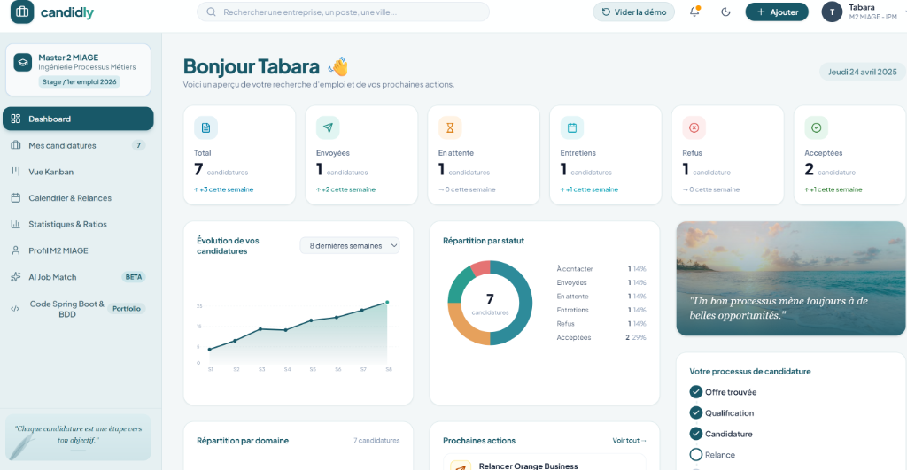
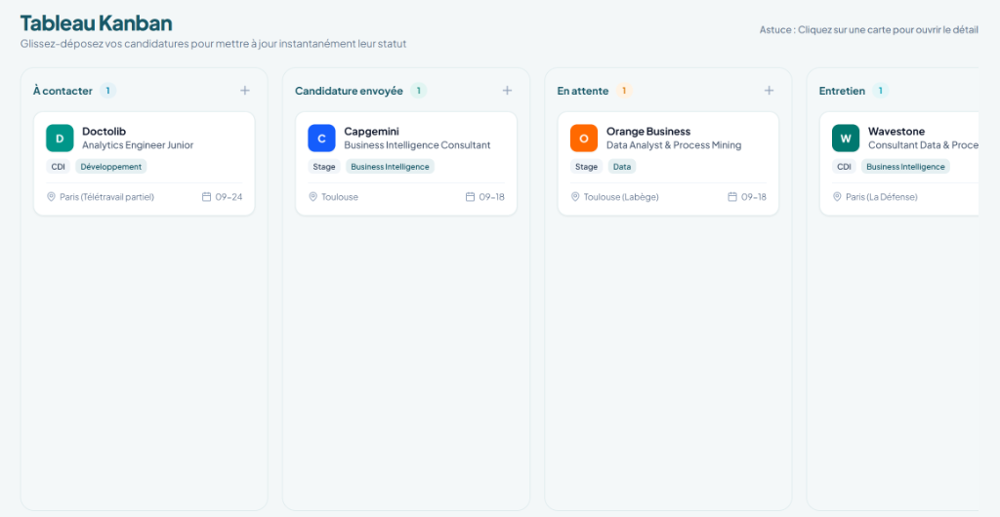
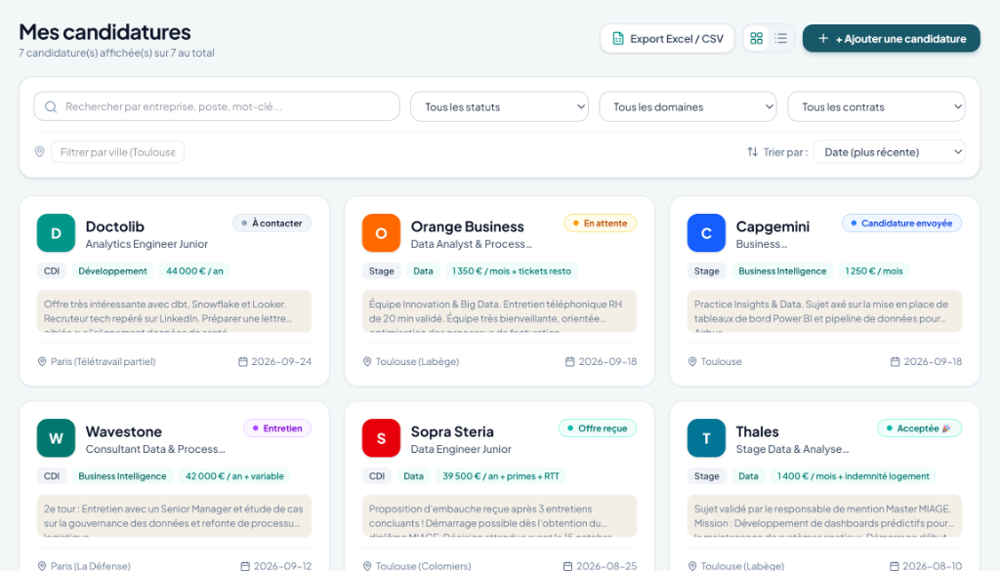
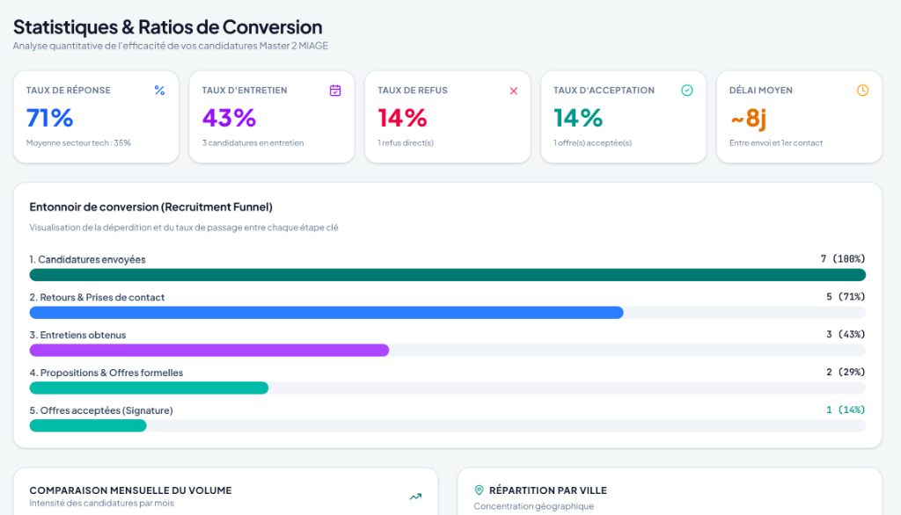

# Candidly — Système de Gestion de Candidatures et Carrière

<div align="center">
  <br />
  <p><b>Une plateforme élégante et complète de suivi de candidatures et de gestion de carrière, conçue avec React 19, TypeScript, Tailwind CSS v4 et une architecture Spring Boot 3 et PostgreSQL.</b></p>
  <br />
  
</div>

---

## 📸 Aperçu de l'Interface

<div align="center">
  <p><b>Tableau de Bord et KPIs</b></p>
  
  <br /><br />
  <p><b>Vue Kanban Glisser-Déposer</b></p>
  
  <br /><br />
  <p><b>Liste des Candidatures et Filtrage</b></p>
  
  <br /><br />
  <p><b>Statistiques et Ratios de Conversion</b></p>
  
</div>

---

## Présentation du Projet

**Candidly** est une application web moderne de suivi de candidatures conçue pour les candidats, alternants et professionnels. Basée sur une charte graphique sur-mesure aux teintes **Bleu Pétrole (`#164E63` / `#185868`)**, **Turquoise (`#2A9D8F`)**, **Sable (`#F4EFE6`)**, **Ivoire (`#FCFCFA`)** et **Anthracite (`#263238`)**, Candidly propose un workflow fluide pour organiser vos démarches de recrutement, planifier vos entretiens, programmer vos relances et analyser vos ratios de conversion.

Conçu comme un projet personnel, Candidly réunit une interface utilisateur réactive (Single Page Application) et une vitrine complète d'architecture Backend (Java Spring Boot 3, Spring Security JWT et schéma PostgreSQL).

---

## Fonctionnalités Principales

### 1. Tableau de Bord (Executive Dashboard)
- **Indicateurs KPI en Temps Réel** : Suivi des candidatures Totales, Envoyées, En attente, Entretiens, Offres reçues et Refus avec badges de progression hebdomadaire.
- **Graphiques et Visualisations** :
  - **Évolution sur 8 Semaines** : Graphique de tendance lissé illustrant le rythme cumulé des candidatures.
  - **Répartition par Statut** : Graphique en anneau (Donut chart) interactif du pipeline actuel.
  - **Répartition par Domaine** : Histogramme synthétique des orientations (Data, Business Intelligence, Développement, IA, DevOps).
- **Widget Prochaines Actions** : Accès direct aux relances de demain et entretiens planifiés.

### 2. Tableau Kanban (Glisser-Déposer)
- Colonnes de processus métier (*À contacter ➔ Candidature envoyée ➔ En attente ➔ Entretien ➔ Offre reçue ➔ Acceptée / Refusée*).
- Fonctionnalité glisser-déposer (Drag et Drop) HTML5 avec mise à jour automatique des statuts et enregistrement dans la timeline.
- Boutons d'ajout rapide par colonne.

### 3. Liste des Candidatures et Filtrage Avancé
- **Double Mode d'Affichage** : Basculez entre la vue en cartes et la vue tableau structurée.
- **Recherche et Filtres Multicritères** : Filtrage par mot-clé (entreprise, poste, ville), statut, domaine, type de contrat (*Stage, Alternance, CDI, CDD*) et localisation.
- **Exportation CSV / Excel en 1 clic** : Téléchargez vos données sous forme de fichier `.csv` structuré pour vos sauvegardes ou bilans académiques.

### 4. Calendrier des Entretiens et Relances
- Calendrier mensuel interactif affichant les entretiens (RH/Techniques) et les dates de relances prévues.
- Rappels automatiques des relances (conseillé à 5–7 jours ouvrés post-candidature).

### 5. Statistiques et Ratios de Carrière
- Calcul des taux de transformation (*Ratio Candidature ➔ Entretien*, *Ratio Entretien ➔ Offre*).
- Temps de réponse moyen et analyse de l'alignement par domaine professionnel.

### 6. Module AI Job Match (Analyseur d'Offres d'Emploi)
Le module **AI Job Match** évolue d'un simple calcul d'adéquation vers un **outil décisionnel d'audit d'offres d'emploi et de préparation aux candidatures** (spécialement adapté aux profils M2 MIAGE et ingénierie de processus).

#### Fonctionnement et Moteur Déterministe Local :
- **Moteur d'Analyse Local** : Analyse le texte de l'offre d'emploi via un ensemble de règles sémantiques et d'expressions régulières strictes sans nécessiter d'API LLM externe.
- **Normalisation Anti-Faux Positifs** :
  - `Postgres` ➔ `PostgreSQL`
  - `PowerBI` ➔ `Power BI`
  - `JS` / `javascript` ➔ `JavaScript`
  - `TS` / `typescript` ➔ `TypeScript`
  - `Spring` ➔ `Spring Boot` (selon contexte)
  - Limites de mots strictes empêchant de détecter `Java` lorsque seul `JavaScript` apparaît dans l'offre.
- **Arbre Hiérarchique de Compétences (Knowledge Tree)** :
  - *Famille JavaScript* : `JavaScript` ➔ `React`, `Node.js`, `TypeScript`, `Vue.js`
  - *Famille SQL* : `SQL` ➔ `PostgreSQL`, `Oracle`, `MySQL`, `SQLite`
  - *Famille Java* : `Java` ➔ `Spring Boot`, `Hibernate`, `Jakarta EE`
  - *Famille BI et Processus* : `Business Intelligence` ➔ `Power BI`, `Tableau` ; `BPMN 2.0` ➔ `Process Mining`, `Celonis`
- **Classification Tripartite** :
  - **✓ Correspondances exactes** : Compétences demandées et présentes dans le profil.
  - **◐ Correspondances partielles** : Liens hiérarchiques Parent ➔ Enfant (ex: profil a `SQL`, l'offre demande `PostgreSQL`), Enfant ➔ Parent (ex: profil a `PostgreSQL`, l'offre demande `SQL`), ou Fratrie (ex: profil a `React`, l'offre demande `JavaScript`).
  - **! Compétences à renforcer** : Exigences clés absentes du profil.
- **Score d'Adéquation Explicable (0 à 100 %)** :
  - *Score Global* avec libellés adaptatifs (*0-39% Faible*, *40-59% Partielle*, *60-79% Bonne*, *80-100% Très bonne*).
  - *Décomposition en 3 sous-scores* : **Compétences (50 %)**, **Mots-clés du poste (30 %)**, **Adéquation profil et domaine MIAGE (20 %)**.
- **Restitution et Sections d'Aide à la Décision** :
  - 📌 **À mettre en avant dans votre candidature** : Les 3 à 5 atouts majeurs du profil à valoriser en tête de CV et lors des entretiens.
  - 📚 **À préparer avant de postuler** : Liste des points d'effort et des lacunes avec explications contextuelles.
  - 🔑 **Mots-clés de l'offre** : Termes à intégrer dans le CV et la lettre de motivation.
  - 💡 **Recommandations stratégiques** : Conseils personnalisés d'entretien.
- **Intégration au Pipeline Candidly** :
  - Bouton **« Enregistrer cette offre comme candidature »** alimentant automatiquement le formulaire `ApplicationModal` existant avec les informations extraites (entreprise, intitulé, domaine, type de contrat, localisation, tags, URL et résumé).
- **Limites Actuelles et Feuille de Route** :
  - Le système actuel est 100 % local et déterministe. Une passerelle optionnelle vers un modèle d'IA générative (ex: Gemini API) est envisagée comme **évolution future**.

### 7. Code Source Backend (Spring Boot 3 et PostgreSQL)
- Visualisation de l'architecture backend complète comprenant :
  - **`schema.sql`** : Script DDL PostgreSQL avec types ENUM, clés étrangères et index de performance.
  - **`Application.java`** : Classe d'entité ORM (Jakarta Persistence / JPA).
  - **`ApplicationController.java`** : Contrôleur API REST Spring Boot.
  - **`SecurityConfig.java`** : Configuration Spring Security 6 avec filtre de jetons JWT.
  - **`pom.xml`** : Descripteur de dépendances Maven.

---

## Charte Graphique et Design System

- **Bleu Pétrole** : `#164E63` / `#185868`
- **Turquoise** : `#2A9D8F`
- **Sable** : `#F4EFE6`
- **Ivoire** : `#FCFCFA`
- **Anthracite** : `#263238`
- **Gestion des Thèmes** : Prise en charge des modes Clair et Sombre (Dark Mode).

---

## Technologies Utilisées

### Frontend
- **Framework** : React 19 (Composants fonctionnels, Hooks personnalisés, Context API)
- **Langage** : TypeScript 5.7+
- **Styling** : Tailwind CSS v4 + Variables CSS personnalisées
- **Icônes** : Lucide React
- **Outil de Build** : Vite 8.3

### Backend (Architecture de démonstration)
- **Framework** : Java 21 / Spring Boot 3.3
- **ORM et Données** : Spring Data JPA / Hibernate
- **Base de Données** : PostgreSQL 16
- **Sécurité** : Spring Security 6 + JJWT (JSON Web Token)
- **Gestionnaire de Projet** : Maven

---

## Installation et Lancement en Local

### Prérequis
- [Node.js](https://nodejs.org/) (version 18.0.0 ou supérieure)
- Un gestionnaire de paquets (`npm` ou `bun`)

### Lancement étape par étape

1. **Cloner le projet** :
   ```bash
   git clone https://github.com/OTabara/candidly.git
   cd candidly
   ```

2. **Installer les dépendances** :
   ```bash
   npm install
   ```

3. **Lancer le serveur de développement** :
   ```bash
   npm run dev
   ```

4. **Accéder à l'application** :
   Ouvrez votre navigateur sur [http://localhost:3000](http://localhost:3000)

### Build de Production

Pour générer le build optimisé pour la production :

```bash
npm run build
```

Pour prévisualiser le build de production en local :

```bash
npm run preview
```

---

## Arborescence du Projet

```
candidly/
├── index.html                    # Point d'entrée HTML et métadonnées
├── package.json                  # Scripts NPM et dépendances
├── vite.config.ts                # Configuration Vite
├── README.md                     # Documentation du projet
├── src/
│   ├── main.tsx                  # Rendu DOM React
│   ├── App.tsx                   # Layout principal et routeur de vues
│   ├── index.css                 # Import Tailwind v4 et variables CSS
│   ├── context/
│   │   └── AppContext.tsx        # Gestion du stockage local et état global
│   ├── components/
│   │   ├── Navbar.tsx            # Barre supérieure (recherche, notifications, mode sombre)
│   │   ├── Sidebar.tsx           # Menu latéral avec citation botanique
│   │   ├── ApplicationModal.tsx  # Formulaire d'ajout et modification
│   │   └── ToastContainer.tsx    # Système de notifications toast
│   ├── data/
│   │   └── initialData.ts        # Données de démonstration et constantes
│   ├── types/
│   │   └── index.ts              # Interfaces et types TypeScript
│   ├── utils/
│   │   └── jobMatchEngine.ts     # Moteur d'analyse déterministe et hiérarchie de compétences
│   └── views/
│       ├── DashboardView.tsx     # Tableau de bord principal (KPIs et graphiques)
│       ├── ApplicationsView.tsx  # Liste des candidatures et export CSV
│       ├── KanbanView.tsx        # Tableau Kanban glisser-déposer
│       ├── CalendarView.tsx      # Calendrier mensuel des entretiens et relances
│       ├── StatisticsView.tsx    # Statistiques et ratios de conversion
│       ├── ProfileView.tsx       # Profil étudiant et compétences
│       ├── AiJobMatchView.tsx    # Analyseur IA de matching, scoring et conseils
│       └── SpringBootCodeView.tsx# Code source backend Java Spring Boot et SQL
```

---

## Sauvegarde des Données

Candidly sauvegarde automatiquement toutes vos candidatures, informations de profil et préférences dans le stockage local de votre navigateur (`localStorage`). Vos données restent conservées d'une session à l'autre sans risque de perte.

Pour démarrer votre propre suivi avec un espace vierge, cliquez sur **"Vider la démo"** dans le menu latéral.

---

## Contexte du Projet

Projet personnel développé pour offrir un outil moderne, élégant et performant de suivi de recherche d'emploi et de gestion de carrière.

---

## Licence

Ce projet est sous licence MIT — consultez le fichier [LICENSE](LICENSE) pour plus de détails.
